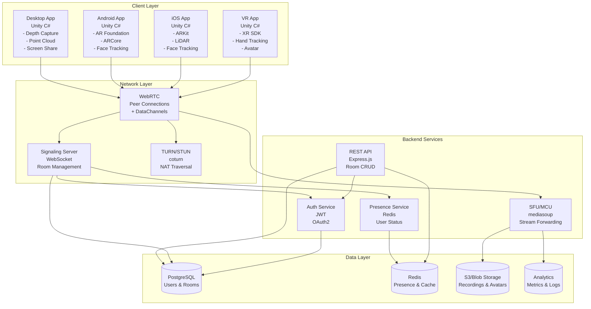
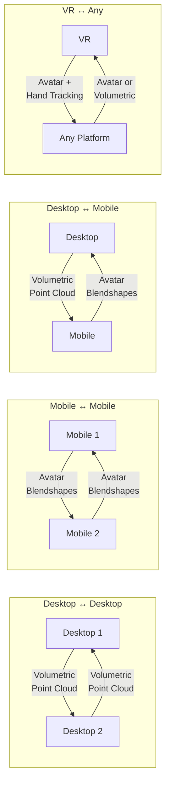
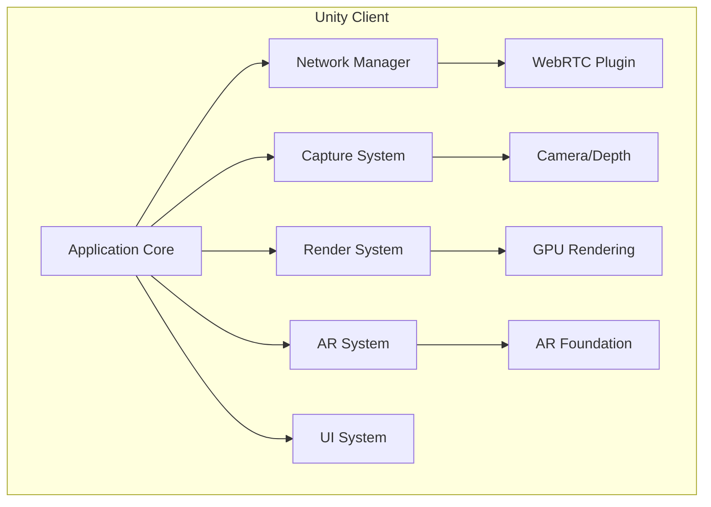
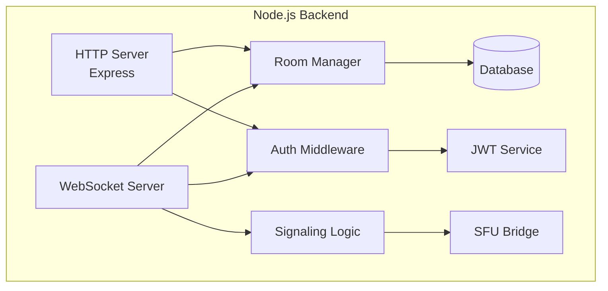
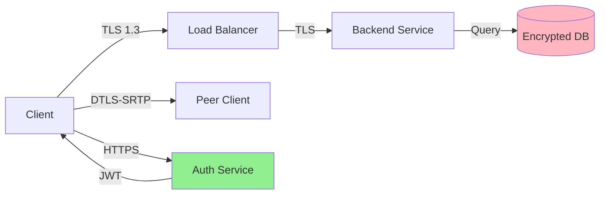
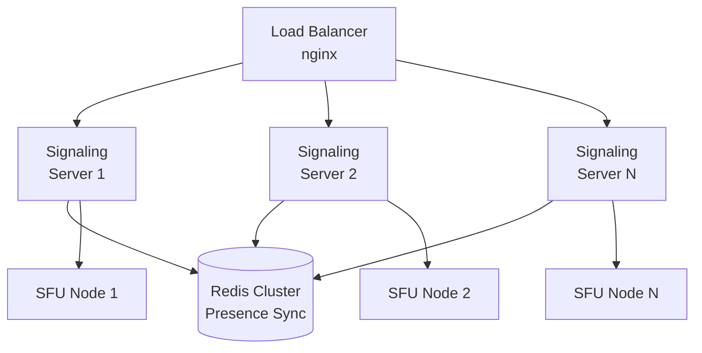
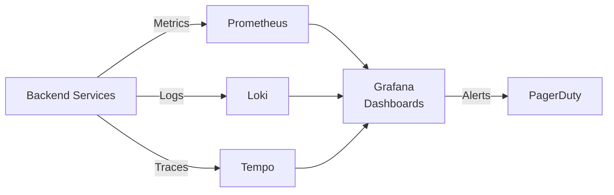

# HoloCall System Architecture

## Overview

HoloCall is a cross-platform holographic telepresence system supporting Desktop, Mobile (Android/iOS), and VR headsets with real-time 3D capture, streaming, and rendering.

## System Architecture Diagram



## Data Flow

### 1. Connection Establishment

```mermaid
sequenceDiagram
    participant C1 as Client 1
    participant SS as Signaling Server
    participant C2 as Client 2
    participant TURN as TURN Server

    C1->>SS: Connect WebSocket + JWT
    SS->>C1: Connection Accepted
    C1->>SS: Create Room
    SS->>C1: Room Created (ID)

    C2->>SS: Connect WebSocket + JWT
    C2->>SS: Join Room (ID)
    SS->>C1: Participant Joined (C2 Info)
    SS->>C2: Room State + Participants

    C1->>SS: SDP Offer
    SS->>C2: SDP Offer (from C1)
    C2->>SS: SDP Answer
    SS->>C1: SDP Answer (from C2)

    C1->>TURN: ICE Candidates
    C2->>TURN: ICE Candidates

    C1<-->C2: WebRTC Connection Established
    C1<-->C2: Audio/Video/Data Streams
```

### 2. Cross-Platform Communication Modes



## Component Details

### Client Architecture



### Backend Architecture



## Platform-Specific Features

| Feature | Desktop | Android | iOS | VR |
|---------|---------|---------|-----|-----|
| **Capture Mode** | Volumetric (Depth) | Avatar (Face) | Avatar (Face + LiDAR) | Avatar (Full Body) |
| **Rendering** | Point Cloud | Avatar Mesh | Avatar Mesh | Avatar Mesh |
| **AR Placement** | ❌ | ✅ ARCore | ✅ ARKit | ✅ Passthrough |
| **Face Tracking** | ❌ | ✅ 52 shapes | ✅ 52 shapes | ✅ (Quest Pro/Vision Pro) |
| **Hand Tracking** | ❌ | ❌ | ❌ | ✅ |
| **Spatial Audio** | ✅ Stereo | ✅ 3D | ✅ 3D | ✅ HRTF |
| **Max Participants** | 10 | 4 | 6 | 8 |
| **Target FPS** | 60 | 30-60 | 60 | 90-120 |

## Network Protocol

### WebRTC Configuration

- **Signaling**: WebSocket over TLS
- **Media Transport**: DTLS-SRTP
- **Data Channels**:
  - Ordered: Audio control, chat
  - Unordered: Hologram data (low latency)
- **Codecs**:
  - Audio: Opus 48kHz
  - Video: VP8/H.264 (fallback)
  - Data: Custom binary protocol

### Data Channel Messages

```typescript
// Avatar Frame (Mobile/VR) - ~100 bytes
{
  type: 'avatar',
  timestamp: number,
  head: {
    position: [x, y, z],      // 12 bytes
    rotation: [x, y, z, w]    // 16 bytes
  },
  blendShapes: Uint8Array(52), // 52 bytes
  hands?: {                    // Optional (VR)
    left: HandData,            // 20 bytes
    right: HandData            // 20 bytes
  }
}

// Volumetric Frame (Desktop) - 10-50 KB
{
  type: 'volumetric',
  timestamp: number,
  format: 'pointcloud',
  pointCount: number,
  compression: 'octree',
  data: ArrayBuffer           // Compressed point cloud
}

// Anchor Sync (AR)
{
  type: 'anchor_sync',
  participantId: string,
  position: [x, y, z],
  rotation: [x, y, z, w],
  cloudAnchorId?: string
}
```

## Security Architecture



### Security Measures

1. **Transport**: TLS 1.3 for all HTTP/WebSocket, DTLS-SRTP for WebRTC
2. **Authentication**: JWT with RS256, 15-min expiry, refresh tokens
3. **Authorization**: Per-room ACLs, host privileges
4. **Privacy**: No persistent storage without consent, optional E2EE
5. **Compliance**: GDPR, CCPA, SOC 2 ready

## Scalability

### Horizontal Scaling



### Capacity Planning

- **Signaling Server**: 10,000 concurrent connections per instance
- **SFU Node**: 100-200 concurrent streams per instance
- **TURN Server**: 1,000 concurrent relays per instance
- **Database**: 1M users on single PostgreSQL instance
- **Redis**: 100K presence records in memory

## Monitoring & Observability



### Key Metrics

- **Performance**: Latency, jitter, packet loss, frame rate
- **Quality**: Audio MOS, video resolution, connection success rate
- **Business**: Active users, session duration, churn rate
- **Infrastructure**: CPU, memory, network throughput, error rates

## Disaster Recovery

- **Database**: Streaming replication + daily backups
- **Redis**: Replica sets for high availability
- **Object Storage**: Multi-region replication
- **Recovery Time Objective (RTO)**: < 15 minutes
- **Recovery Point Objective (RPO)**: < 5 minutes

## Technology Stack Summary

### Frontend (Unity)
- Unity 2022.3 LTS
- AR Foundation 5.1+
- WebRTC for Unity
- URP (Universal Render Pipeline)
- Platform-specific SDKs (ARKit, ARCore, Oculus XR)

### Backend (Node.js)
- Node.js 18 LTS
- TypeScript 5.0
- Express.js 4.18
- ws (WebSocket)
- mediasoup (SFU)
- PostgreSQL 15
- Redis 7

### Infrastructure
- Docker & Kubernetes
- nginx (Load Balancer)
- coturn (TURN/STUN)
- Prometheus + Grafana
- AWS/GCP/Azure compatible

## Performance Targets

| Metric | Target | Measurement |
|--------|--------|-------------|
| Audio Latency | < 100ms | End-to-end |
| Video Latency | < 200ms | End-to-end |
| Avatar Latency | < 250ms | End-to-end |
| Frame Rate | 60 FPS | Desktop/Mobile |
| VR Frame Rate | 90-120 FPS | VR headsets |
| Join Time | < 3s | Room entry |
| Battery Life | 45+ min | Mobile |
| VR Battery Life | 90+ min | Quest headsets |
| Packet Loss | < 2% | Network quality |
| Jitter | < 30ms | Network stability |

## Development Roadmap

### Phase 1: MVP (Weeks 1-4)
- Basic signaling server
- 1:1 calls (audio + video)
- Desktop and mobile clients
- Avatar system for mobile

### Phase 2: Core Features (Weeks 5-6)
- Volumetric capture (desktop)
- Group calls (4 participants)
- AR placement system
- Spatial audio

### Phase 3: Platform Expansion (Weeks 7-8)
- VR support
- Cross-platform compatibility
- Performance optimization
- Production deployment

### Phase 4: Advanced Features (Post-MVP)
- Screen sharing
- Recording
- Cloud anchors
- Advanced UI/UX
